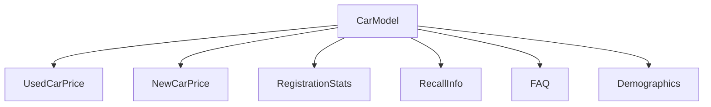

# 🚗 데이터 기반 중고차 vs 신차 가성비 분석 시스템

실제 시장 데이터를 기반으로 중고차와 신차의 가성비를 비교 분석하여, 사용자가 최적의 구매 결정을 내릴 수 있도록 지원하는 웹 애플리케이션입니다.

## 🌟 주요 기능

### 📊 데이터 기반 분석
- **공공데이터**: 국토교통부 자동차 등록 현황
- **시장데이터**: 엔카, K카 등에서 실시간 중고차 시세 수집
- **신뢰성데이터**: 자동차리콜센터 리콜 이력 분석

### ⚖️ 중고차 vs 신차 비교
- 중고차 평균 시세 + 사용자 추가 예산으로 구매 가능한 신차 추천
- 가성비 점수 계산 (가격, 신뢰도, 인기도 종합)
- 총 소유비용(TCO) 분석

### 📈 시각화 대시보드
- Streamlit 기반 인터랙티브 웹 인터페이스
- 실시간 차트 및 그래프
- 지역별, 제조사별, 모델별 상세 통계

### ⏰ 자동화 시스템
- 스케줄러 기반 자동 데이터 수집
- 시스템 모니터링 및 알림
- 데이터 품질 검증 및 정리

## 🏗️ 시스템 아키텍처

```
📁 프로젝트 구조
├── 📂 analyzers/          # 데이터 분석 모듈
│   └── price_analyzer.py  # 가격 분석 로직
├── 📂 config/             # 설정 파일
│   ├── config.py         # 메인 설정
│   └── scheduler_config.json  # 스케줄러 설정
├── 📂 crawlers/           # 데이터 수집 모듈
│   ├── encar_crawler.py  # 엔카 크롤러
│   ├── recall_crawler.py # 리콜 정보 크롤러
│   └── public_data_crawler.py  # 공공데이터 크롤러
├── 📂 database/           # 데이터베이스 관련
│   ├── database_schema.py # DB 스키마 정의
│   └── db_helper.py      # DB 헬퍼 함수
├── 📂 ui/                # 사용자 인터페이스
│   └── streamlit_app.py  # Streamlit 앱
├── 📂 logs/              # 로그 파일
├── 📂 data/              # 데이터 파일
│   └── 📂 backup/        # 백업 파일
├── scheduler_enhanced.py  # 향상된 스케줄러
├── init_data.py          # 샘플 데이터 생성
├── run.py               # 메인 실행 스크립트
├── setup.py             # 설치 스크립트
└── start.bat            # Windows 실행 파일
```

## 🚀 빠른 시작

### 1. 자동 설치 (권장)

```bash
# 1. 저장소 클론
git clone [repository-url]
cd pj1

# 2. 자동 설치 실행
python setup.py
```

### 2. 수동 설치

**요구사항**
- Python 3.8+
- MySQL 8.0+
- Chrome 브라우저 (크롤링용)

**설치 단계**

```bash
# 1. 의존성 설치
pip install -r requirements.txt
pip install psutil

# 2. 데이터베이스 초기화
python run.py init

# 3. 샘플 데이터 생성 (선택)
python init_data.py

# 4. 시스템 테스트
python run.py test
```

### 3. 실행

**웹 애플리케이션**
```bash
python run.py run
# 또는
streamlit run ui/streamlit_app.py
```

**스케줄러 (백그라운드)**
```bash
python scheduler_enhanced.py
```

**Windows 사용자**
```bash
# 배치 파일 실행
start.bat
```

## 📋 주요 명령어

### 메인 실행 스크립트
```bash
# 웹앱 실행
python run.py run

# 데이터베이스 초기화
python run.py init

# 데이터 크롤링
python run.py crawl

# 시스템 테스트
python run.py test
```

### 스케줄러
```bash
# 기본 실행
python scheduler_enhanced.py

# 특정 작업만 실행
python scheduler_enhanced.py --task price
python scheduler_enhanced.py --task recall
python scheduler_enhanced.py --task health
python scheduler_enhanced.py --task cleanup

# 테스트 모드
python scheduler_enhanced.py --test

# 설정 파일 사용
python scheduler_enhanced.py --config config/scheduler_config.json
```

## 📊 데이터베이스 스키마

### 주요 테이블
- **CarModel**: 자동차 모델 마스터 정보
- **UsedCarPrice**: 중고차 가격 정보
- **NewCarPrice**: 신차 가격 정보
- **RegistrationStats**: 지역별 등록 현황
- **RecallInfo**: 리콜 정보
- **CrawlingLog**: 크롤링 로그

### ERD


## ⏰ 스케줄러 작업

### 자동 실행 작업
- **매일 03:00**: 중고차 가격 업데이트
- **매일 23:30**: 일일 리포트 생성
- **매주 월요일 04:00**: 리콜 정보 업데이트
- **매주 일요일 01:00**: 데이터베이스 백업
- **매주 일요일 02:00**: 오래된 데이터 정리
- **매월 1일 05:00**: 등록 현황 업데이트
- **매시간**: 시스템 건강 상태 체크

### 고급 기능
- 🔄 실패 시 자동 재시도
- 📈 시스템 리소스 모니터링
- 📧 이메일 알림 (설정 시)
- 📊 성능 통계 수집
- 🔍 데이터 품질 검증

## 🎛️ 설정

### 데이터베이스 설정 (config/config.py)
```python
DATABASE_CONFIG = {
    'host': 'localhost',
    'user': 'root',
    'password': 'your_password',
    'database': 'car_analysis_db',
    'charset': 'utf8mb4'
}
```

### 스케줄러 설정 (config/scheduler_config.json)
```json
{
  "scheduler": {
    "max_retries": 3,
    "enable_performance_monitoring": true
  },
  "email": {
    "enabled": false,
    "smtp_server": "smtp.gmail.com",
    "email": "your_email@gmail.com"
  }
}
```

## 📱 사용자 인터페이스

### 메인 탭
1. **📊 전국 자동차 트렌드**: 인기 모델, 지역별 현황
2. **🔍 모델 상세 분석**: 특정 모델의 가격, 리콜, 가성비 분석
3. **⚖️ 중고차 vs 신차 비교**: 핵심 기능, 구매 추천
4. **📈 데이터 관리**: 크롤링 상태, 로그 확인

### 주요 기능
- 🎛️ 사이드바 필터 (제조사, 모델, 예산)
- 📊 인터랙티브 차트 (Plotly)
- 📋 상세 비교표
- ⚠️ 리콜 정보 표시
- 💰 가성비 점수 계산

## 🔧 문제해결

### 일반적인 문제

**1. MySQL 연결 실패**
```bash
# MySQL 서비스 확인
# Windows: services.msc에서 MySQL 서비스 상태 확인
# 사용자 권한 확인

# 방화벽 설정 확인
# 3306 포트 열려있는지 확인
```

**2. 크롤링 실패**
```bash
# Chrome 드라이버 업데이트
pip install --upgrade webdriver-manager

# 네트워크 연결 확인
# VPN 사용시 IP 차단 가능성 확인
```

**3. Streamlit 실행 오류**
```bash
# 포트 충돌 확인
streamlit run ui/streamlit_app.py --server.port 8502

# 캐시 정리
streamlit cache clear
```

### 로그 확인
- **앱 로그**: `logs/app_YYYYMMDD.log`
- **스케줄러 로그**: `logs/scheduler_YYYYMMDD.log`
- **일일 리포트**: `logs/daily_report_YYYYMMDD.json`

## 🤝 기여

1. Fork the repository
2. Create feature branch (`git checkout -b feature/AmazingFeature`)
3. Commit changes (`git commit -m 'Add AmazingFeature'`)
4. Push to branch (`git push origin feature/AmazingFeature`)
5. Open a Pull Request

## 📄 라이선스

이 프로젝트는 MIT 라이선스 하에 있습니다. 자세한 내용은 [LICENSE](LICENSE) 파일을 참조하세요.

## 📞 지원

문제가 있거나 제안사항이 있으시면 이슈를 생성해주세요.

### 주요 연락처
- 📧 이메일: [your-email@example.com]
- 💬 이슈: [GitHub Issues]

---

## 📈 향후 계획

### v2.0 (예정)
- [ ] AI 기반 가격 예측 모델
- [ ] 사용자 계정 및 즐겨찾기 기능
- [ ] 모바일 앱 개발
- [ ] 실시간 알림 시스템

### v1.5 (진행 중)
- [x] 향상된 스케줄러
- [x] 시스템 모니터링
- [x] 데이터 백업 시스템
- [ ] API 서버 개발
- [ ] Docker 컨테이너화

---

**⭐ 이 프로젝트가 도움이 되셨다면 별표를 눌러주세요!**
